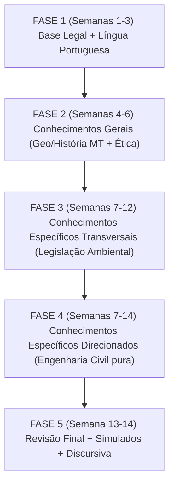

---
tags:
  - fluxo
  - estrategia
  - planejamento
---
# 📋 Fluxo de Estudo — Plano Completo

## Diagrama de Fluxo

## Detalhamento das Fases

### FASE 1 (Semanas 1-3): Base Legal + Língua Portuguesa
- **Objetivo da fase:** Construir base sólida na língua nativa e no entendimento inicial das leis.
- **Matérias a estudar:** [[Língua Portuguesa]], Legislação inicial.
- **Carga horária sugerida:** 15h a 20h / semana.
- **Estratégia de estudo:** Leitura ativa da teoria, resolução massiva de questões da Cesgranrio.
- **Marcos de validação:** Mini-simulados semanais de Português (meta: >80% de acerto).

### FASE 2 (Semanas 4-6): Conhecimentos Gerais (Geo/História MT + Ética)
- **Objetivo da fase:** Dominar o contexto regional e regras éticas.
- **Matérias a estudar:** [[Geografia/História MT]], [[Ética/Filosofia/Atualidades/Legislação]].
- **Carga horária sugerida:** 15h a 20h / semana.
- **Estratégia de estudo:** Criação de mapas mentais, leitura focada.
- **Marcos de validação:** Resolução de questões históricas e de concursos regionais.

### FASE 3 (Semanas 7-12): Conhecimentos Específicos Transversais (Legislação Ambiental)
- **Objetivo da fase:** Compreender todo o arcabouço jurídico ambiental essencial para o cargo.
- **Matérias a estudar:** [[Conhecimentos Específicos]] (Legislação).
- **Carga horária sugerida:** 25h / semana.
- **Estratégia de estudo:** Leitura da lei seca, resumos e flashcards (Spaced Repetition).
- **Marcos de validação:** Exercícios simulando casos práticos, >75% de acertos.

### FASE 4 (Semanas 7-14): Conhecimentos Específicos Direcionados (Engenharia Civil pura)
- **Objetivo da fase:** Aprofundar nos temas técnicos da Engenharia Civil.
- **Matérias a estudar:** [[Conhecimentos Específicos]] (Engenharia Civil).
- **Carga horária sugerida:** 25h / semana (em paralelo com Fase 3).
- **Estratégia de estudo:** Resolução de questões de cálculo, leitura de normas técnicas (ABNT).
- **Marcos de validação:** Simulado técnico, % de acerto esperado de 70-80%.

### FASE 5 (Semana 13-14): Revisão Final + Simulados + Discursiva
- **Objetivo da fase:** Consolidação do conhecimento e treino de tempo de prova.
- **Matérias a estudar:** Revisão geral de todas as matérias e [[Prova Discursiva]].
- **Carga horária sugerida:** 30h / semana.
- **Estratégia de estudo:** Simulados completos e redação com cronômetro.
- **Marcos de validação:** Simulado completo > 45 pts (Objetiva), Discursiva estruturada.

## Estratégia de Estudo por Peso
- **Conhecimentos Específicos:** 40 questões (57% da prova) → dedicar ~50-55% do tempo.
- **Língua Portuguesa:** 15 questões (21%) → dedicar ~15% do tempo.
- **Geo/História MT:** 10 questões (14%) → dedicar ~15% do tempo.
- **Ética/Legislação:** 5 questões (7%) → dedicar ~10% do tempo.
- **Discursiva:** (10 pts separados) → treinar 1 redação/semana a partir da semana 6.

## Ciclo Semanal de Estudo

| Dia da Semana | Matéria 1 | Matéria 2 | Extra |
| :--- | :--- | :--- | :--- |
| Segunda | Conhecimentos Específicos | Língua Portuguesa | Flashcards |
| Terça | Conhecimentos Específicos | Geo/História MT | Exercícios |
| Quarta | Conhecimentos Específicos | Ética/Legislação | Leitura de Lei |
| Quinta | Conhecimentos Específicos | Língua Portuguesa | Exercícios |
| Sexta | Revisão da Semana | Conhecimentos Específicos | Simulados parciais |
| Sábado | Discursiva | Geo/História MT | Correção e Resumo |
| Domingo | Descanso / Simulado Geral | | |

## Técnicas de Estudo Recomendadas
- **Pomodoro:** Blocos de 25-50 min de foco total.
- **Active Recall:** Tentar lembrar do conteúdo sem ler antes.
- **Spaced Repetition:** Revisões em intervalos crescentes.
- **Mapas Mentais:** Para visualização de tópicos de Geo/História e Leis.

> [!WARNING]
> É obrigatório obter no mínimo 42 pontos na prova objetiva e não zerar nenhuma disciplina. Dê atenção a todas as matérias!

> [!TIP]
> A prova discursiva tem peso importantíssimo como critério de desempate e aprovação (mínimo de 6,0 pontos). Treine a escrita!
